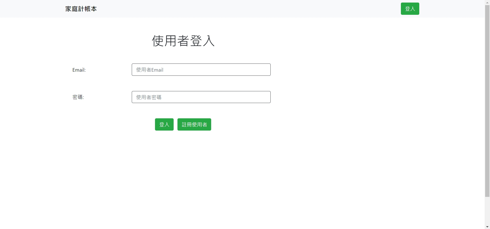
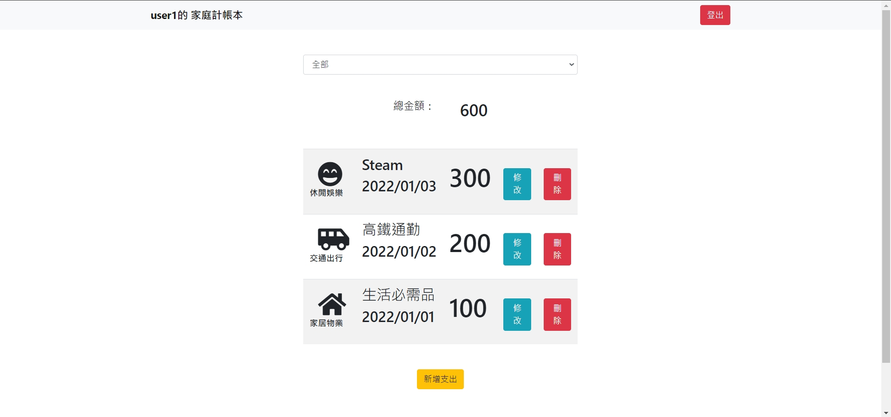

# Expense-Tracker(Update 2022/1/15)
這是一個使用node.js及express建構而成的網站，此網站可以讓使用者新增/修改/刪除個別的每日費用支出，也可利用費用種類篩選出想查看的費用支出。

## 專案畫面



## 產品功能
1. 使用者需使用Email註冊使用者資料才可登入
2. 使用者可新增/修改/刪除專屬於自己的費用支出資料
3. 使用者可使用下拉選單篩選想查看的費用種類之支出
4. 首面名稱會依使用者名稱而有變化

## 環境建置
* Node.js
* Express
* MongoDB
* Mongoose

## 專案安裝流程
1. 打開終端機，clone專案至本機
```
git clone https://github.com/deansyue/expense-tracker.git
```

2. 前往專案資料夾
```
cd expense-tracker
```
3. 安裝npm套件
```
npm install
```
4.使用腳本，創建種子資料
```
npm run seed
```
5.使用腳本，啟動伺服器
```
npm run dev
```
6. 當終端機出現下列訊息，代表伺服器與資料庫已啟動
```
Express is running on http://localhost:3000
mongodb connected!
```

## 種子資料使用者
可使用種子資料新增的使用者操作本專案
```
user1
  email: user1@example.com
  password: 12345678
```
```
user2
  email: user2@example.com
  password: 12345678
```

## 專案開發人員
[deansyue](https://github.com/deansyue)